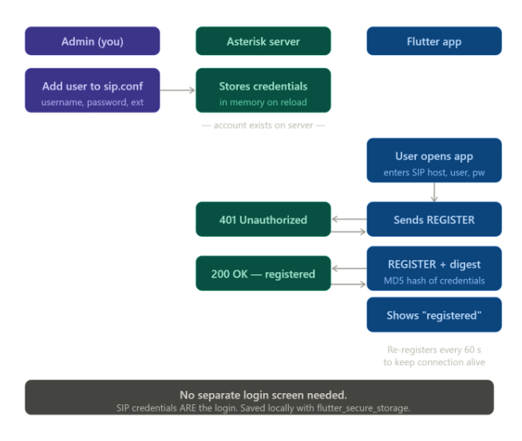
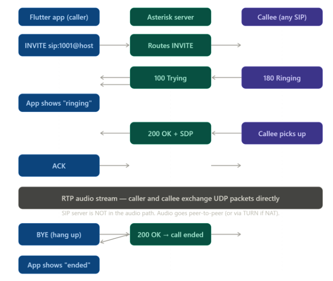

This is the plan:

I want you to build an open-source competitor for SIP phone applications. To understand what a SIP phone software looks like, take a reference from Bria — it provides SIP phone functionality across both mobile and desktop.

For implementation, you can use Flutter so that we can have a single codebase for both desktop and mobile apps.

This will be the core project direction.
https://www.counterpath.com/bria-mobile

Two flows matter most: how a user gets registered on the SIP server, and what happens when they make a call. Here they are, one at a time.

Now the call flow — what happens from the moment the user taps "call" to when audio is flowing.---

How registration works — the full picture
There is no "login system" you need to build. SIP handles it natively. Here's exactly what you do at each level:
On the server (sip.conf in Asterisk):
[1001]
type=friend
secret=password123
host=dynamic
context=phones

That's one user. 1001 is their extension (also their username). secret is their password. host=dynamic means they can register from any IP. Repeat this block for every user. Reload Asterisk — done.
On the Flutter app (sip_service.dart):
final settings = UaSettings();
settings.webSocketUrl  = 'ws://YOUR_SERVER_IP:8088/ws';
settings.uri           = 'sip:1001@YOUR_SERVER_IP';
settings.authorizationUser = '1001';
settings.password      = 'password123';
settings.displayName   = 'User Name';

_ua = UA(settings);
_ua.start();

That's it. dart_sip_ua fires the REGISTER automatically when you call _ua.start(). It also handles the 401 → digest-auth retry automatically. You never write that part.
What happens on first launch:
App shows a Settings screen with three fields: SIP server IP, username, password.
User fills these in once and taps Save.
You store them with flutter_secure_storage (encrypted on device).
On every subsequent launch, you read them back and call _ua.start().
If registration succeeds → show "Ready". If it fails (wrong password, server unreachable) → show an error on the same screen

There is no separate account database you need to build. Asterisk is the user database. Adding/removing users is editing sip.conf and running asterisk -rx "sip reload".

What to build — screens and services only
4 screens:
SettingsScreen — server IP, username, password, Save button. Shown on first launch or when not registered.
DialpadScreen — number input + call button. Only shown when registered.
CallScreen — shown during an active call. Shows duration, mute toggle, hang-up button.
CallLogScreen — list of past calls from local storage.
3 services:
SipService — wraps dart_sip_ua. Exposes register(), call(number), hangup(), mute(), and a stream of call state changes.
AudioService — (physical devices)wraps flutter_webrtc. Starts/stops the mic. Switches between earpiece and speaker.
StorageService — flutter_secure_storage for credentials, shared_preferences for call log.

Local vs real world — exactly what changes

Local dev
Real world
Server
Asterisk in Docker on your laptop
Same Docker image on a $5 VPS
App config
Server IP = 192.168.x.x (your LAN IP)
Server IP = your VPS public IP
WebSocket
ws://192.168.x.x:8088/ws
wss://yourdomain.com:8089/ws (TLS)
NAT
Not an issue (same network)
Add STUN: stun:stun.l.google.com:19302 in UaSettings
Firewall
Nothing to open
Open UDP 5060 (SIP) + 10000–20000 (RTP)

One line of config changes between local and production. Everything else is identical.

Why NAT is a problem for SIP calls
SIP and RTP (audio) need two-way communication. When your app sends audio to the other person, it tells them "send audio back to me at 192.168.1.5:10000". But that address is private — the other person is on the internet and has no idea how to reach 192.168.1.5. The audio gets lost.
Your app says:  "send RTP audio to 192.168.1.5:10000"
Other person:   has no route to 192.168.1.5
Result:         one-way audio or no audio at all

How it's solved — STUN
A STUN server is a simple public server that tells your app what its real public IP and port looks like from the outside.
Your app  →  STUN server:  "what's my public address?"
STUN      →  "you are 203.0.113.45:54321"
Your app  →  tells the other person "send audio to 203.0.113.45:54321"
Router    →  forwards it to your private IP correctly
You just add one line in your Flutter app:
dart
settings.iceServers = [
  {'url': 'stun:stun.l.google.com:19302'}
];
Google runs a free public STUN server. That one line fixes NAT for most cases.

When STUN isn't enough — TURN
Some strict corporate firewalls or mobile networks block direct peer-to-peer connections entirely. STUN won't work because there's no path through at all. In that case you need a TURN server — it acts as a relay, bouncing the audio through itself.
Without TURN:   your app  ←→  other person   (blocked)
With TURN:      your app  →  TURN server  →  other person
Twilio provides TURN servers automatically. For local dev with Asterisk you won't hit this problem because you're on the same network.

In plain terms

What it is
NAT
Your router hiding your real local IP from the internet
STUN
A free lookup service that tells your app its real public address
TURN
A relay server for when direct connection is completely blocked

